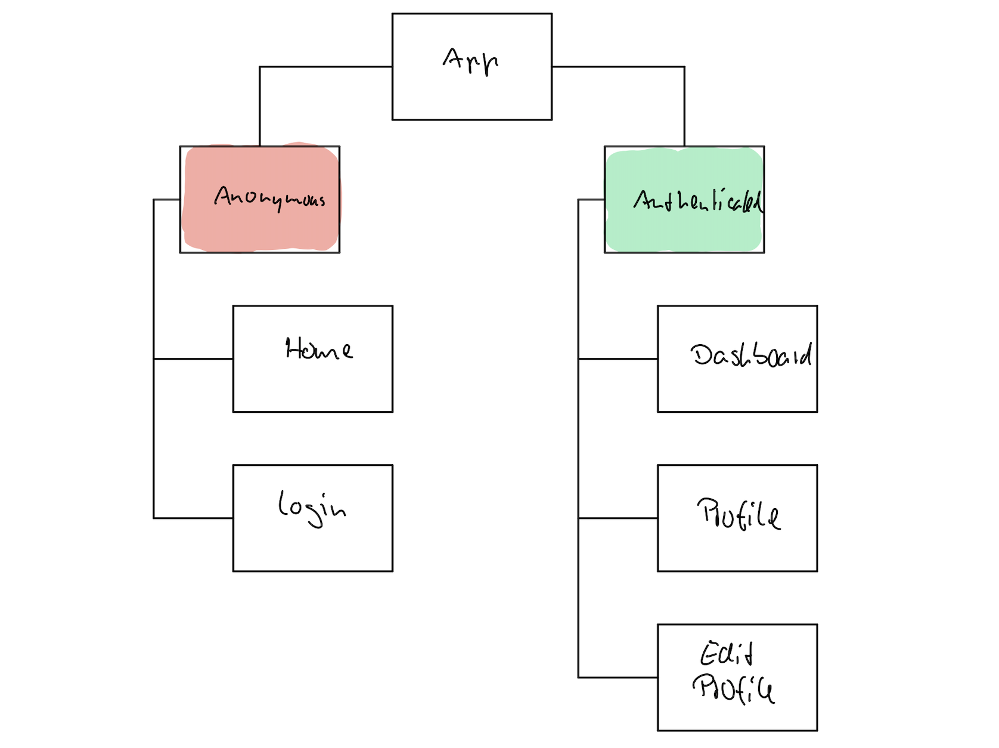

# Typesafe SPA

This is a small demo that explores different approaches for creating a potentially scalable single page application. See [here](https://aspnetde.github.io/typesafe-spa/) for the completely unspectacular sample apps in action.

## Structure

## Functionality

- There is a global session object that potentially can hold shared state for all parts of the application.
- The login page authenticates the user and initates the creation of the session.
- After logging in, the user is redirected to the dashboard, where they are welcomed by name.
- There is an additional profile page, showing the name again.
- From the profile page it's possible to go to an "edit profile" page that allows changing that name.
- After the name has changed, that change must be reflected in all parts of the application: dashboard, and profile page.
- Although "edit profile" could be seen as a child of "profile", it is kept on the same level for simplicity reasons (we potentially already are at the third level here).

## Goals

That scope of functionality allows us to look at the following questions:

1. How are parent-child relationships handled?
2. How much boiler-plate code needs to be written?
3. How much guidance and support provides the compiler?
4. And after all: How maintanable aka scalable does the approach appear to be?

## Approaches

### Elmish + Feliz

- Based on [Elmish](https://elmish.github.io/elmish/) and [Feliz](https://github.com/Zaid-Ajaj/Feliz)
- [Demo app](https://aspnetde.github.io/typesafe-spa/elmish-feliz)

## Observations

### Elmish + Feliz

- When introducing intents (aka external messages), the parent doesn't know about them until we start handling them there. So the compiler wouldn't complain if we forget to add it to the parent(s).
- Routing can fail silently when the expected route isn't found. Sometimes that's just a matter of lower and upper case letters.
- `Feliz.Router` is best being used with arrays representing the url segments, because that's what can be passed to the `format()` function (it does not accept lists).
- The Feliz syntax felt rather verbose at first. Unfortunately, `Html` is a type and not a module and therefore "cannot be opened". However, in direct comparison to the "classic" Elmish view syntax, for real world tasks there seems not to be that much of a difference in terms of the number of written lines of code. Good old HTML will in most cases still stay shorter, though...

## Resources

- [Elmish Parent-child composition](https://elmish.github.io/elmish/parent-child.html#Parent-child-composition)
- [Elm Shared State example](https://github.com/ohanhi/elm-shared-state)
- [Design of Large Elm apps](https://groups.google.com/forum/#!msg/elm-discuss/_cfOu88oCx4/madaA1rBAQAJ)
- [elm-taco-donut](https://github.com/madasebrof/elm-taco-donut)
- [Pros/cons of Elmish vs plain React components (via Fable.React)](https://github.com/elmish/elmish/issues/154 )
- [Child-Parent Communication in Elm: OutMsg vs Translator vs NoMap Patterns](https://medium.com/@_rchaves_/child-parent-communication-in-elm-outmsg-vs-translator-vs-nomap-patterns-f51b2a25ecb1)
